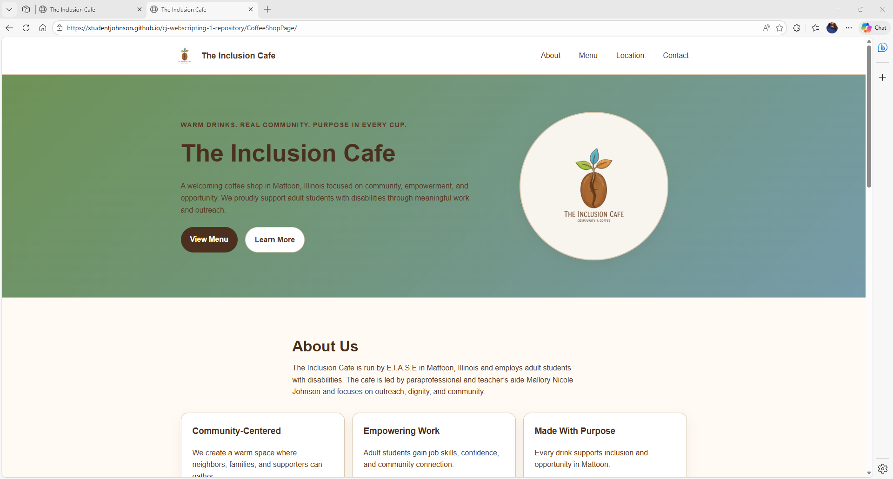
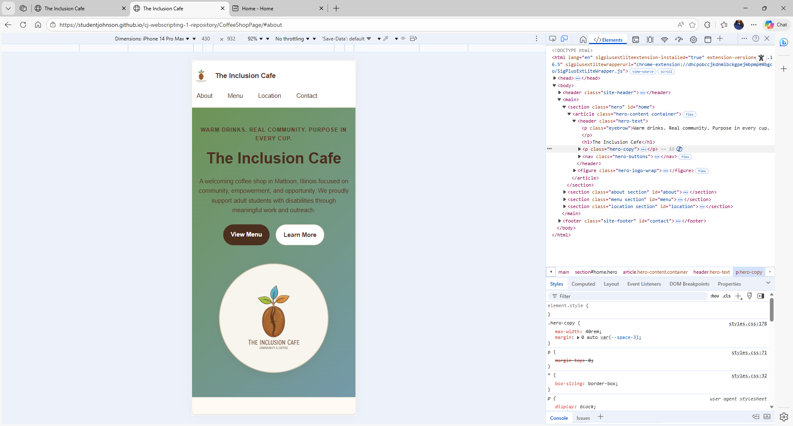

# The Inclusion Cafe Landing Page

A responsive coffee shop landing page built using Flexbox, CSS Grid, and mobile-first design principles.

This project recreates Mockup C: Coffee Shop Landing and focuses on layout, accessibility, and responsive design.

## Live Site

GitHub Pages link:

https://YOUR-USERNAME.github.io/YOUR-REPOSITORY-NAME/

## Project Overview

The Inclusion Cafe is a community-centered coffee shop in Mattoon, Illinois that employs adult students with disabilities.  
The cafe is run by E.I.A.S.E and led by Paraprofessional and Teacher's Aide Mallory Nicole Johnson.

The goal of the cafe is to promote inclusion, skill development, and meaningful outreach in the community.

Address:

1617 Lakeland Blvd  
Mattoon, IL 61938

## Features

- Responsive mobile-first layout
- Flexbox navbar
- Grid menu layout
- Consistent spacing and typography scale
- Accessible heading structure
- Embedded Google Map
- Community-focused coffee shop design
- Hover states for buttons
- Container-based layout for readability

## Technologies Used

- HTML5
- CSS3
- Flexbox
- CSS Grid
- Mobile-first responsive design
- Google Maps embed

## Layout Sections

The page includes the following sections:

1. Navbar  
   - Brand logo  
   - Navigation links  

2. Hero Section  
   - Logo centerpiece  
   - Introduction text  
   - Call-to-action buttons  

3. About Section  
   - Information about the mission of the cafe  

4. Menu Section  
   - Coffee flavors  
   - Tea flavors  
   - Community suggested flavors  

5. Location Section  
   - Address  
   - Map  
   - Get Directions button  

6. Footer  
   - Quick links  
   - Location information  

## Menu Highlights

### Coffee (Unsweetened with Flavor Add-ins)

- Caramel  
- Mocha  
- Hazelnut  
- Vanilla  

### Tea (Unsweetened with Flavor Add-ins)

- Raspberry  
- Strawberry Blackberry  
- Orange Cherry  
- Peach Blue Raspberry  
- Watermelon  
- Coconut  

### Suggested Community Flavors

Customers can vote for new flavors including:

- Lavender Vanilla  
- Honey Cinnamon  
- Apple Spice  
- Mango Peach  

## Screenshots

### Desktop View

### Mobile View

## Responsive Design

The layout was built mobile-first with breakpoints at:

- 48rem – tablet layout
- 64rem – desktop layout

Flexbox and Grid were used to ensure the layout adapts across screen sizes.

## Author

Created for a Web Layout assignment using Mockup C.

Project concept: The Inclusion Cafe
