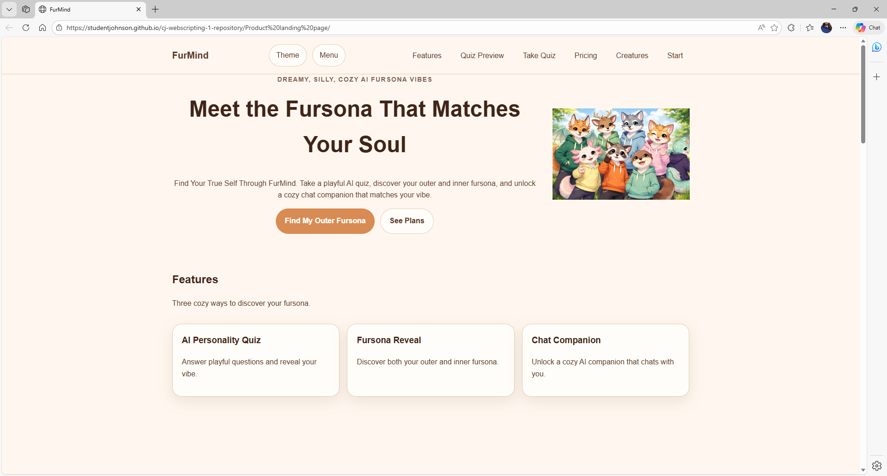
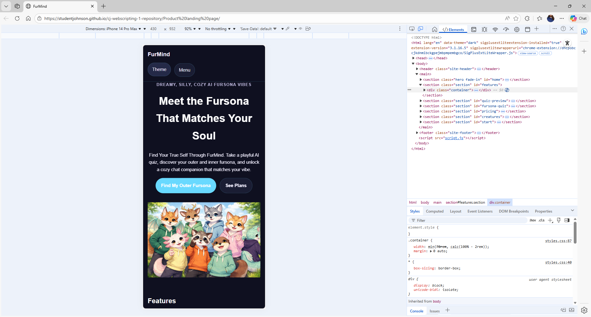

# FurMind Product Landing Page

## Description

FurMind is a responsive product landing page for a fictional AI-powered personality quiz web app. The app allows users to discover their **Outer Fursona** and **Inner Fursona** through a playful personality quiz and unlock an **AI chat companion experience** based on their results.

The design focuses on a cozy, dreamy aesthetic with **peach, gold, and soft brown tones** in light mode and **teal, purple, and midnight neon tones** in dark mode.

This project demonstrates responsive layout design, UI polish, theme switching, and basic interactive functionality using HTML, CSS, and JavaScript.

---

## Live Site

GitHub Pages  
https://studentjohnson.github.io/cj-webscripting-1-repository/Product%20landing%20page

---

## Repository

GitHub Repository  
https://github.com/studentjohnson/cj-webscripting-1-repository

---

## Features Checklist

### Layout
- CSS Grid used for major sections (features, pricing, creature gallery)
- Flexbox used for navbar, hero layout, and buttons
- Mobile-first design
- Two responsive breakpoints

### Responsive Navigation
- Navigation works on mobile and desktop
- Mobile navigation toggle menu

### Animations
- Hover transitions on cards
- Hover transitions on buttons
- Fade-in animation on hero section

### Dark Mode
- CSS variables used for theme colors
- Dark mode toggle button
- Theme preference saved using **localStorage**

### Accessibility
- One `h1` heading
- Visible keyboard focus styles
- Readable color contrast

---

## Page Sections

- Responsive Navbar
- Hero Section
- Features Section
- Quiz Preview
- Fursona Quiz
- Pricing Section
- Creature Gallery
- Call To Action
- Footer

---

## Screenshots

### Desktop



### Mobile



---

## Project Files

```
index.html
styles.css
script.js
README.md
desktop.png
mobile.png
images/
```

---

## Notes

FurMind is presented as a cozy AI web app concept where users take a personality quiz to discover a fursona that reflects their personality and vibe. The project demonstrates responsive web design techniques using **Flexbox, CSS Grid, CSS variables, animations, and JavaScript interactions**.
