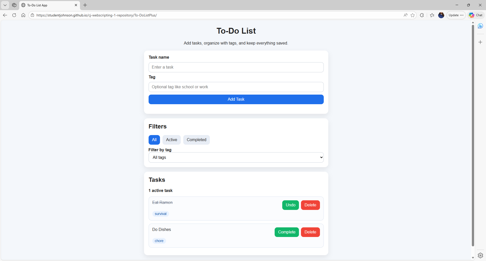
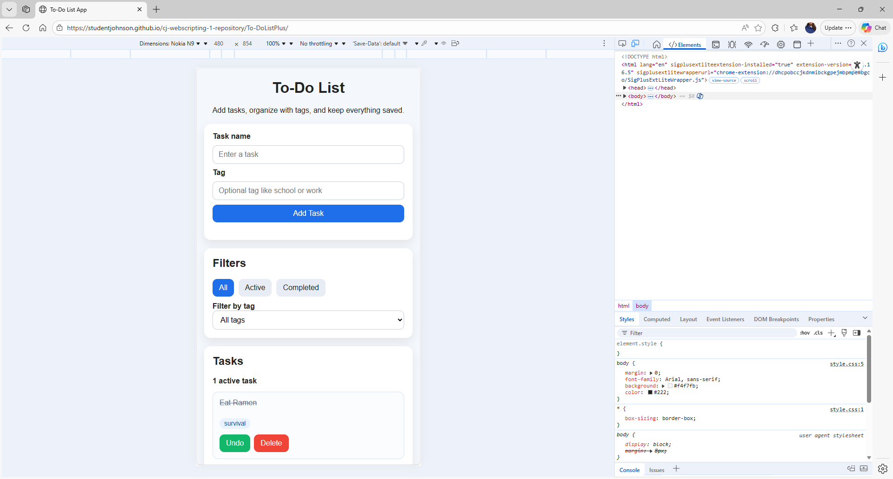

# To-Do List App

## GitHub Page
https://studentjohnson.github.io/cj-webscripting-1-repository/To-DoListPlus

## GitHub Repository
https://github.com/studentjohnson/cj-webscripting-1-repository

## Features
- Add a new task
- Add an optional custom tag
- Display all tasks in a list
- Mark tasks as complete
- Delete tasks
- Filter by All, Active, and Completed
- Filter by tag
- Save tasks with localStorage
- Show validation if task name is blank
- Clear the form after adding a task
- Show an active task counter

## Screenshot
### Desktop

### Mobile

## Built With
- HTML
- CSS
- JavaScript
- localStorage

## Notes
This project was built as a beginner-friendly to-do list app using vanilla JavaScript. It stores tasks in localStorage so they stay saved after refreshing the page.
